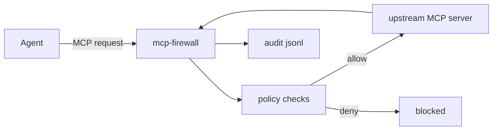

# mcp-firewall
WAF-style reverse-proxy/sidecar that enforces security policy for MCP traffic.


## What it does
`mcp-firewall` sits between an MCP client/agent and MCP servers, then enforces policy before requests reach tools. It supports allow/deny by tool and path, origin checks, optional Ed25519 signature validation, rate limiting, and audit logging with JSONL output.

## Who it’s for
- Platform/security engineers deploying MCP in production
- Agent infrastructure teams that need policy boundaries
- DevOps/SRE teams that need auditable MCP traffic controls
- OSS maintainers shipping MCP servers safely

## Features
- Reverse-proxy endpoint for MCP JSON-RPC (`/mcp`)
- Tool allowlist/denylist enforcement
- Path prefix restrictions in request parameters
- Origin allowlist enforcement
- Optional Ed25519 request signature verification
- Optional Ed25519 response signing
- Rate limiting per origin/IP + method
- Append-only JSONL audit logs
- `doctor` and `demo` CLI commands for operability

## Quickstart
### Installation
```bash
git clone https://github.com/OWNER/mcp-firewall.git
cd mcp-firewall
make setup
```

### Run in 2–5 minutes
```bash
cp .env.example .env
cat > examples/minimal/upstream-mock.sh <<'SH'
#!/usr/bin/env bash
python3 -m http.server 3001 >/dev/null 2>&1
SH
chmod +x examples/minimal/upstream-mock.sh
./examples/minimal/upstream-mock.sh &

cargo run -p mcp-firewall -- run \
  --config examples/minimal/policy.yml \
  --upstream http://127.0.0.1:3001 \
  --listen 127.0.0.1:8787
```

## Example output / screenshots
`make demo` produces a real artifact at `examples/output/demo-result.json`:

```json
{
  "project": "mcp-firewall",
  "version": "0.1.0",
  "checks": [
    {"name": "tool_allowlist", "result": "pass"},
    {"name": "path_restriction", "result": "pass"},
    {"name": "origin_auth", "result": "pass"},
    {"name": "signature_verification", "result": "pass"},
    {"name": "rate_limit", "result": "pass"}
  ]
}
```

## How it works


The firewall receives MCP JSON-RPC requests at `/mcp`, parses method + params, and applies policy checks.
Policy includes allow/deny tools, allowed path prefixes, max body size, origin allowlist, signature verification, and rate limit.
Denied traffic returns clear 4xx errors and still gets audited.
Allowed traffic is forwarded to upstream and response status is logged.
When enabled, responses are signed with Ed25519 and returned in `x-mcp-firewall-signature`.
Full architecture: [docs/ARCHITECTURE.md](docs/ARCHITECTURE.md).

## Configuration
- Policy file format: `examples/minimal/policy.yml`, `examples/advanced/policy.yml`
- CLI flags:
  - `--config`, `--upstream`, `--listen`, `--audit-log`
  - `--verify-key-hex`, `--sign-key-hex`
- Env examples in `.env.example`
- Full matrix: [docs/CONFIG.md](docs/CONFIG.md)

## Troubleshooting
- **`blocked_by_policy`**: check allowlist/denylist and `allowed_paths` in policy.
- **`origin_not_allowed`**: align `Origin` header with `allowed_origins`.
- **`signature_missing_or_invalid`**: pass valid Ed25519 signature in `x-mcp-signature`.
- **`upstream_unreachable`**: verify upstream URL and network reachability.
- **Rate limit errors**: increase `rate_limit_per_minute` or reduce request burst.

## Contributing
See [CONTRIBUTING.md](CONTRIBUTING.md).

## Security
Keep keys outside git (env/secret manager), never commit private keys, and review [SECURITY.md](SECURITY.md) before production rollout.

## License
[MIT](LICENSE)
