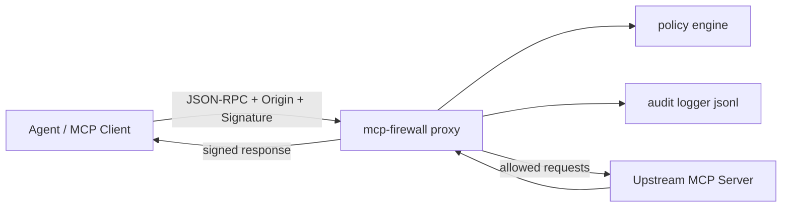

# Architecture

## Dataflow
1. Client sends MCP request to `/mcp`.
2. Proxy parses method/params and checks rate-limit.
3. Policy engine applies allow/deny rules for tool, path, origin, body size, signature.
4. Decision is written to audit JSONL.
5. Allowed traffic is forwarded to upstream MCP server.
6. Optional response signature is attached before returning to client.
